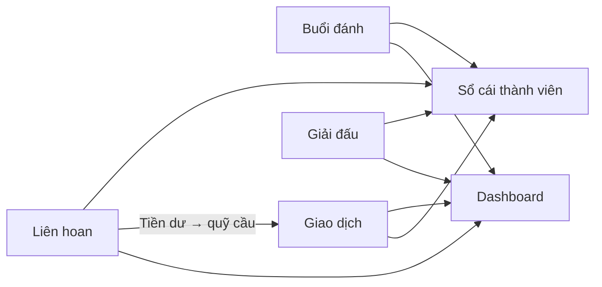

# Yêu cầu hệ thống — Quản lý chi phí chơi cầu lông B15

> Nguồn: [`B15-THEO DÕI CHI PHÍ CHƠI CẦU LÔNG.xlsx`](B15-THEO DÕI CHI PHÍ CHƠI CẦU LÔNG.xlsx)  
> Phiên bản: 1.0  
> Ngôn ngữ giao diện: Tiếng Việt

---

## 1. Tổng quan dự án

### 1.1 Mục tiêu

Xây dựng website thay thế file Excel hiện tại, giúp nhóm cầu lông B15:

- Ghi nhận chi phí từng buổi đánh và chia tiền cho từng lông thủ
- Quản lý sổ thu/chi (đóng quỹ, mua cầu, thuê sân, v.v.)
- Theo dõi số dư quỹ chung và sổ cái cá nhân từng thành viên
- Quản lý chi phí giải đấu và liên hoan

### 1.2 Đối tượng sử dụng

| Vai trò | Mô tả |
|---------|-------|
| **Thủ quỹ / Admin** | Ghi buổi đánh, thu/chi, giải đấu, liên hoan; xem toàn bộ báo cáo |
| **Lông thủ (Thành viên)** | Xem số tiền đã đóng, chi phí chơi, số tiền còn lại của bản thân |

### 1.3 Phạm vi

**Full parity** với 5 sheet Excel:

| Sheet Excel | Module web |
|-------------|------------|
| Tổng quan | Dashboard |
| Theo dõi đánh cầu | Buổi đánh |
| Giao dịch | Giao dịch thu/chi |
| Chia bảng thi đấu | Giải đấu |
| Liên hoan 1804 | Liên hoan |

### 1.4 Quy ước chung

- **Tiền tệ:** VND (đồng Việt Nam)
- **Định dạng hiển thị:** Phân cách hàng nghìn (VD: `1.065.000`)
- **Không hỗ trợ:** Thuế, đa tiền tệ, tỷ giá

### 1.5 Dữ liệu tham chiếu từ Excel

| Chỉ số | Giá trị |
|--------|---------|
| Số thành viên | 14 |
| Số buổi đánh | 94 |
| Tổng chi | 41.016.000 |
| Tổng thu | 42.081.000 |
| Số dư quỹ | 1.065.000 |
| Giá cầu/quả | 24.500 |
| Tồn kho cầu | 686 quả |

---

## 2. Thuật ngữ và thực thể dữ liệu

### 2.1 Thuật ngữ

| Thuật ngữ | Ý nghĩa |
|-----------|---------|
| **Lông thủ** | Thành viên nhóm chơi cầu lông |
| **Quỹ** | Khoản tiền chung của nhóm |
| **Đóng quỹ** | Thành viên nộp tiền vào quỹ chung |
| **Buổi đánh** | Một lần chơi cầu, có chi phí chia cho người tham gia |
| **Thua kèo / Thua kèo bia** | Tiền thua cược (bia, ăn uống) trong liên hoan hoặc giải |
| **Option** | Chi phí khác, không thuộc các loại chuẩn |

### 2.2 Thực thể chính

```
Member          — Thành viên (lông thủ)
Session         — Buổi đánh cầu
SessionShare    — Phân bổ chi phí buổi đánh cho từng thành viên
Transaction     — Giao dịch thu hoặc chi
Tournament      — Giải đấu / phân bảng thi đấu
TournamentMember — Thành viên tham gia giải + quỹ cá nhân
TournamentExpense — Chi phí giải (huy chương, banner, v.v.)
Party           — Sự kiện liên hoan
PartyMember     — Phân bổ chi phí liên hoan từng người
Settings        — Cấu hình toàn cục (giá cầu, tồn kho)
```

### 2.3 Danh sách thành viên mẫu (14 người)

Hằng, Lực, Hoàng, Yến, Tuấn, Giới, Trung, Bố anh Trung, Hải Anh, Vân, Hùng, Thích, Sơn Lê, Sơn Trần

> **Lưu ý:** Sheet Tổng quan dùng tên rút gọn "Sơn" cho Sơn Lê. Hệ thống cần thống nhất alias hoặc cho phép map tên.

### 2.4 Loại khoản chi

| Mã | Tên | Mô tả |
|----|-----|-------|
| `COURT_RENTAL` | Thuê sân | Tiền thuê sân chơi |
| `SHUTTLE_PURCHASE` | Mua cầu | Mua cầu lông (có số lượng quả/hộp) |
| `WATER` | Nước | Nước uống tại sân |
| `PARKING` | Gửi xe | Phí gửi xe |
| `OPTION` | Option | Chi phí khác (liên hoan, giải, v.v.) |

### 2.5 Loại khoản thu

| Mã | Tên | Mô tả |
|----|-----|-------|
| `FUND_CONTRIBUTION` | Đóng quỹ | Thành viên nộp tiền vào quỹ |
| `OPTIONAL` | Optional | Thu khác (hiện tại = 0 trong Excel) |

---

## 3. Module — Theo dõi đánh cầu (Buổi đánh)

**Map từ sheet:** `Theo dõi đánh cầu`

### 3.1 Mục đích

Ghi nhận từng buổi chơi cầu: chi phí thành phần, số người tham gia, và số tiền mỗi người phải chịu.

### 3.2 Map cột Excel → Trường dữ liệu

| Cột Excel | Trường hệ thống | Kiểu | Bắt buộc | Ghi chú |
|-----------|-----------------|------|----------|---------|
| A | `date` | Date | Có | Ngày buổi chơi |
| B, V | `total_cost` | Number | Có | Tổng chi phí buổi (2 cột trùng nhau trong Excel) |
| C–P | `shares[].amount` | Number | Không | Phân bổ từng thành viên; 0 = không tham gia |
| Q | `court_type` | String | Không | Loại sân |
| R | `shuttles_used` | Number | Không | Số quả cầu dùng |
| S | `court_rental` | Number | Không | Tiền thuê sân |
| T | `water` | Number | Không | Tiền nước uống |
| U | `parking` | Number | Không | Tiền gửi xe |
| W | `cost_per_person` | Number | Tự tính | Chi phí trung bình/người tham gia |
| X | `note` | String | Không | Ghi chú ngoại lệ |

**Cấu hình toàn cục (hàng 1–2 Excel):**

| Vị trí Excel | Trường | Giá trị mẫu |
|--------------|--------|-------------|
| S1 | `shuttle_price_per_unit` | 24.500 |
| R2 | `shuttle_inventory` | 686 |

### 3.3 Quy tắc nghiệp vụ

1. **Tổng chi phí buổi (mặc định):**
   ```
   total_cost = court_rental + water + parking + (shuttles_used × shuttle_price_per_unit)
   ```
   Trong đó `water` và `parking` mặc định = 0 nếu không nhập.

2. **Phân bổ cho từng người:**
   ```
   cost_per_person = total_cost / số_người_tham_gia
   ```
   Số người tham gia = số thành viên có `share.amount > 0`.

3. **Người không tham gia:** `share.amount = 0`.

4. **Ngoại lệ thủ công:** Cho phép ghi chú và điều chỉnh phân bổ không đều (VD: buổi 03/08/2025 — "Yến mua 5 quả cầu ngoài 157k", một số người = 0).

5. **Tồn kho cầu:** Mỗi buổi trừ `shuttles_used` khỏi tồn kho (nếu bật theo dõi tồn kho).

### 3.4 Yêu cầu chức năng

| ID | Yêu cầu | Ưu tiên |
|----|---------|---------|
| S-01 | Tạo buổi đánh mới với ngày, chi phí thành phần | Must |
| S-02 | Chọn nhanh danh sách người tham gia (checkbox 14 thành viên) | Must |
| S-03 | Tự tính `total_cost`, `cost_per_person`, phân bổ đều | Must |
| S-04 | Cho phép sửa thủ công phân bổ từng người | Must |
| S-05 | Ghi chú ngoại lệ cho buổi đánh | Should |
| S-06 | Danh sách buổi đánh, lọc theo ngày / thành viên | Must |
| S-07 | Sửa / xóa mềm buổi đánh | Must |
| S-08 | Cấu hình giá cầu/quả và tồn kho cầu | Should |
| S-09 | Import buổi đánh từ Excel | Could (Phase 2) |

### 3.5 Màn hình đề xuất

- **Danh sách buổi đánh:** Bảng ngày, tổng chi phí, số người, ghi chú
- **Form buổi đánh:** Chi phí thành phần + chọn người tham gia + preview phân bổ
- **Cấu hình cầu:** Giá/quả, tồn kho hiện tại

---

## 4. Module — Giao dịch (Thu / Chi)

**Map từ sheet:** `Giao dịch`

Sheet gồm 2 vùng song song: **Khoản chi** (trái) và **Khoản thu** (phải).

### 4.1 Khoản chi — Map cột Excel

| Cột Excel | Trường | Kiểu | Bắt buộc | Ghi chú |
|-----------|--------|------|----------|---------|
| B | `date` | Date | Không | Một số dòng không có ngày (gộp chung) |
| C | `amount` | Number | Có | Số tiền chi |
| D | `description` | String | Không | Mô tả (VD: "2 hộp cầu S90") |
| E | `quantity` | Number | Không | Số quả/hộp cầu; chỉ khi category = Mua cầu |
| F | `category` | Enum | Có | Thuê sân / Mua cầu / Nước / Gửi xe / Option |

### 4.2 Khoản thu — Map cột Excel

| Cột Excel | Trường | Kiểu | Bắt buộc | Ghi chú |
|-----------|--------|------|----------|---------|
| J | `date` | Date | Có | Ngày thu |
| K | `amount` | Number | Có | Số tiền thu |
| L | `member_name` | String | Có | Tên người đóng quỹ |
| M | `category` | Enum | Có | Mặc định: Đóng quỹ |
| N | `note` | String | Không | Ghi chú (VD: "Hoàng mua 1 hộp cầu ck quỹ luôn") |

### 4.3 Thống kê loại giao dịch (từ Excel)

**Khoản chi (số lượng giao dịch):**

| Loại | Số giao dịch |
|------|--------------|
| Thuê sân | 89 |
| Mua cầu | 44 |
| Nước | 23 |
| Gửi xe | 7 |
| Option | 9 |

**Khoản thu:** Chủ yếu category "Đóng quỹ", gắn với tên thành viên ở trường `member_name`.

### 4.4 Quy tắc nghiệp vụ

1. Mỗi giao dịch thu hoặc chi là bản ghi độc lập.
2. Khi category = **Mua cầu**, hiển thị trường `quantity` (số quả).
3. Khi thu **Đóng quỹ**, bắt buộc chọn thành viên (`member_name`).
4. Ghi chú dùng cho trường hợp đặc biệt: chuyển khoản quỹ luôn, chuyển tiền dư liên hoan, topup quỹ, v.v.
5. Giao dịch chi không bắt buộc có ngày (tương thích Excel), nhưng khuyến khích nhập ngày.

### 4.5 Yêu cầu chức năng

| ID | Yêu cầu | Ưu tiên |
|----|---------|---------|
| T-01 | Form thêm khoản chi riêng | Must |
| T-02 | Form thêm khoản thu (đóng quỹ) riêng | Must |
| T-03 | Dropdown 5 loại chi | Must |
| T-04 | Dropdown thành viên khi thu | Must |
| T-05 | Trường số lượng cầu khi Mua cầu | Must |
| T-06 | Trường ghi chú | Should |
| T-07 | Danh sách giao dịch, lọc theo loại / ngày / thành viên | Must |
| T-08 | Sửa / xóa mềm giao dịch | Must |
| T-09 | Import giao dịch từ Excel | Could (Phase 2) |

---

## 5. Module — Tổng quan (Dashboard)

**Map từ sheet:** `Tổng quan`

### 5.1 Tóm tắt quỹ

| Chỉ số | Công thức | Giá trị mẫu |
|--------|-----------|-------------|
| Tổng chi | Σ(khoản chi) | 41.016.000 |
| Tổng thu | Σ(khoản thu) | 42.081.000 |
| Số dư quỹ | Tổng thu − Tổng chi | 1.065.000 |

### 5.2 Phân loại chi phí

| Loại | Tổng (VND) |
|------|------------|
| Thuê sân | 15.305.000 |
| Mua cầu | 17.967.000 |
| Nước | 1.012.000 |
| Gửi xe | 130.000 |
| Option | 6.602.000 |

### 5.3 Sổ cái thành viên

| Cột Excel | Trường | Ý nghĩa |
|-----------|--------|---------|
| B | `member_name` | Tên lông thủ |
| C | `total_paid` | Tổng tiền đã đóng quỹ |
| D | `total_play_cost` | Tổng chi phí chơi đã phân bổ |
| E | `remaining_balance` | Số tiền còn lại |

**Công thức:**
```
remaining_balance = total_paid - total_play_cost
```

- **Dương:** Còn tiền trong quỹ cá nhân (không cần đóng thêm)
- **Âm:** Phải đóng thêm (VD: Hoàng −857.242, Yến −217.560, Tuấn −425.879)

### 5.4 Nguồn dữ liệu tổng hợp

Dashboard được tính từ:

- **Tổng chi / phân loại chi:** Module Giao dịch (khoản chi)
- **Tổng thu:** Module Giao dịch (khoản thu)
- **Chi phí chơi cá nhân:** Module Buổi đánh (phân bổ) + chi phí giải/liên hoan liên quan
- **Tổng đã đóng:** Module Giao dịch (thu Đóng quỹ theo thành viên)

### 5.5 Yêu cầu chức năng

| ID | Yêu cầu | Ưu tiên |
|----|---------|---------|
| D-01 | Hiển thị Tổng chi, Tổng thu, Số dư quỹ | Must |
| D-02 | Bảng phân loại chi phí theo 5 loại | Must |
| D-03 | Bảng sổ cái 14 thành viên | Must |
| D-04 | Highlight thành viên âm quỹ (màu cảnh báo) | Must |
| D-05 | Cập nhật real-time khi thêm/sửa buổi đánh hoặc giao dịch | Must |
| D-06 | Biểu đồ phân bổ chi phí theo loại | Should |
| D-07 | Export báo cáo PDF/Excel | Could |

---

## 6. Module — Chia bảng thi đấu (Giải đấu)

**Map từ sheet:** `Chia bảng thi đấu`

### 6.1 Mục đích

Quản lý giải đấu nội bộ: phân bảng A/B, nhóm tập luyện, quỹ giải cá nhân, chi phí giải, và tiền còn phải đóng.

### 6.2 Phân bảng đấu — Map cột Excel

| Cột Excel | Trường | Mô tả |
|-----------|--------|-------|
| C | `order` | STT |
| D | `group_a_member` | Thành viên Bảng A |
| E | `group_b_member` | Thành viên Bảng B |
| M | `practice_group_name` | Tên nhóm tập (Nhóm 1, 2, 3) |
| O | `practice_group_members` | Danh sách thành viên nhóm (text) |

**Ví dụ từ Excel:**

| STT | Bảng A | Bảng B |
|-----|--------|--------|
| 1 | Trung | Sơn |
| 2 | Văn | Thích |
| 3 | Hoàng | Lực |
| 4 | Giới | Tuấn |
| 5 | Hằng | Yến |

**Nhóm tập:**

| Nhóm | Thành viên |
|------|------------|
| Nhóm 1 | Sơn, Trung, Văn, Thích, cháu a Sơn, Hoàng |
| Nhóm 2 | Tuấn, Lực, Giới, Hùng |
| Nhóm 3 | Yến, Hằng |

### 6.3 Quỹ giải cá nhân — Map cột Excel (từ hàng 13)

| Cột Excel | Trường | Mô tả |
|-----------|--------|-------|
| C | `member_name` | Thành viên |
| D | `fund_amount` | Số tiền quỹ đã nộp |
| E | `payment_status` | Trạng thái (Đã nộp / chưa nộp) |
| F | `beer_bet_loss` | Thua kèo bia |
| G | `personal_expense_paid` | Tiền đã chi mua đồ (huy chương, banner...) |
| H | `amount_due` | Còn phải đóng |
| I | `personal_fund_remaining` | Quỹ cá nhân còn |

**Công thức:**
```
amount_due = entry_fee + meal_cost + beer_bet_loss - fund_amount - personal_expense_paid
```

Trong đó:
- `entry_fee` = Phí thi đấu (cấu hình theo giải)
- `meal_cost` = Tiền ăn (cấu hình theo giải)

### 6.4 Chi phí giải — Map cột Excel

| Cột Excel | Trường | Ví dụ |
|-----------|--------|-------|
| K | `expense_name` | Huy chương, Tất nữ, Banner, Nước uống ở sân, Thuê Sân, Cầu dùng |
| L | `paid_by` | Qũy / tên thành viên |
| M | `amount` | Số tiền |

### 6.5 Liên kết liên hoan giải

Sheet ghi thêm thông tin liên hoan gắn giải (cột O–Q):

- **Liên hoan Dũng Xoăn 13 người:** 4.573.000 (−420k kèo bia)
- **Mỗi người:** 320.000

### 6.6 Yêu cầu chức năng

| ID | Yêu cầu | Ưu tiên |
|----|---------|---------|
| G-01 | Tạo giải đấu (tên, ngày, phí thi đấu, tiền ăn) | Must |
| G-02 | Phân thành viên vào Bảng A / Bảng B | Must |
| G-03 | Tạo nhóm tập với danh sách thành viên | Should |
| G-04 | Ghi quỹ đã nộp và trạng thái từng người | Must |
| G-05 | Ghi thua kèo bia từng người | Must |
| G-06 | Ghi chi phí giải (tên, người chi, tiền) | Must |
| G-07 | Tự tính "Còn phải đóng" theo công thức | Must |
| G-08 | Hiển thị quỹ cá nhân còn | Should |
| G-09 | Liên kết chi phí liên hoan của giải | Should |

---

## 7. Module — Liên hoan (Sự kiện)

**Map từ sheet:** `Liên hoan 1804`

Hỗ trợ nhiều sự kiện liên hoan (VD: 18/04, 16/05).

### 7.1 Thông tin sự kiện — Map cột Excel

| Vùng Excel | Trường | Mô tả | Ví dụ |
|------------|--------|-------|-------|
| A | `venue_name` | Nhà hàng / địa điểm | Dũng Xoăn, TinyFun |
| B | `total_bill` | Tổng bill | 3.317.000 |
| C | `adjustment_note` | Ghi chú điều chỉnh bill | "đã trừ 100k suất mì Hằng gọi riêng mang về" |
| D | `event_label` | Nhãn sự kiện | "Liên hoan: 18/04" |
| A (hàng 3) | `total_attendees` | Tổng số người | 11 |

### 7.2 Phân bổ từng người — Map cột Excel

**Sự kiện 18/04:**

| Cột Excel | Trường | Mô tả |
|-----------|--------|-------|
| E | `member_name` | Thành viên |
| F | `bet_loss` | Thua kèo |
| H | `extra_meal_cost` | Tiền ăn đóng thêm |
| I | `total_amount` | Tổng tiền |

**Sự kiện 16/05 (bảng mở rộng):**

| Cột Excel | Trường | Mô tả |
|-----------|--------|-------|
| F | `item_purchase_cost` | Chi mua đồ |
| G | `bet_loss` | Thua kèo |
| H | `bet_loss_reason` | Lý do thua kèo |
| I | `extra_meal_cost` | Tiền ăn đóng thêm |
| J | `amount_due` | Tiền phải đóng |
| K | `net_total` | Tổng tiền nhận về |

**Ví dụ lý do thua kèo:** "100 (nửa con cá) + 20 (đĩa đậu)", "140 (tháp bia)"

### 7.3 Quy tắc nghiệp vụ

1. **Tiền ăn cơ bản mỗi người (sau khi trừ thua kèo):**
   ```
   base_meal_per_person = (total_bill - Σ bet_loss) / total_attendees
   ```

2. **Tổng tiền mỗi người (sự kiện 18/04):**
   ```
   total_amount = extra_meal_cost + bet_loss
   ```

3. **Tiền phải đóng (sự kiện 16/05):**
   ```
   amount_due = extra_meal_cost + bet_loss + item_purchase_cost (± điều chỉnh)
   net_total = amount_received - amount_due (có thể âm nếu nợ)
   ```

4. **Điều chỉnh bill:** Cho phép trừ khoản riêng trước khi chia (VD: trừ 100k suất mang về).

5. **Liên kết quỹ:** Tiền dư liên hoan có thể chuyển vào quỹ cầu (tạo giao dịch thu trong module Giao dịch).

### 7.4 Yêu cầu chức năng

| ID | Yêu cầu | Ưu tiên |
|----|---------|---------|
| P-01 | CRUD sự kiện liên hoan | Must |
| P-02 | Nhập bill tổng, số người, ghi chú điều chỉnh | Must |
| P-03 | Tự tính tiền ăn cơ bản/người | Must |
| P-04 | Ghi thua kèo + lý do từng người | Must |
| P-05 | Tổng hợp ai còn nợ / ai được hoàn | Must |
| P-06 | Hỗ trợ nhiều sự kiện (18/04, 16/05, ...) | Must |
| P-07 | Tạo giao dịch chuyển tiền dư vào quỹ cầu | Should |

---

## 8. Quy tắc tính toán tổng hợp

### 8.1 Quỹ chung

```
Số dư quỹ = Σ(Khoản thu) − Σ(Khoản chi)
```

### 8.2 Buổi đánh

```
Chi phí cầu = shuttles_used × shuttle_price_per_unit
Tổng chi phí buổi = court_rental + water + parking + Chi phí cầu
Mỗi người = Tổng chi phí buổi / số người tham gia
```

### 8.3 Sổ cái thành viên

```
Tổng đã đóng [member] = Σ(Giao dịch thu Đóng quỹ của member)
Chi phí chơi [member] = Σ(Phân bổ buổi đánh) + Σ(Chi phí giải/liên hoan liên quan)
Số tiền còn lại [member] = Tổng đã đóng − Chi phí chơi
```

- Số tiền còn lại **âm** → thành viên phải đóng thêm
- Số tiền còn lại **dương** → thành viên còn dư trong quỹ cá nhân

### 8.4 Giải đấu

```
Còn phải đóng = Phí thi đấu + Tiền ăn + Thua kèo bia − Số tiền quỹ − Tiền đã chi mua đồ
Quỹ cá nhân còn = Số tiền quỹ + Tiền đã chi mua đồ − Phí thi đấu − Tiền ăn − Thua kèo bia (± điều chỉnh)
```

### 8.5 Liên hoan

```
Tiền ăn cơ bản/người = (Tổng bill − Σ thua kèo − điều chỉnh) / Tổng số người
Tổng tiền [member] = Tiền ăn đóng thêm + Thua kèo (+/- chi mua đồ, điều chỉnh)
```

### 8.6 Luồng dữ liệu giữa các module



---

## 9. Yêu cầu phi chức năng

| ID | Yêu cầu | Mô tả |
|----|---------|-------|
| NF-01 | Ngôn ngữ | Giao diện tiếng Việt; giữ thuật ngữ Excel |
| NF-02 | Responsive | Dùng được trên mobile (ghi buổi đánh nhanh sau khi chơi) |
| NF-03 | Phân quyền | Admin (thủ quỹ) vs Member (chỉ xem dữ liệu cá nhân) |
| NF-04 | Audit log | Lưu lịch sử thay đổi; xóa mềm, không xóa cứng |
| NF-05 | Định dạng tiền | VND, phân cách hàng nghìn |
| NF-06 | Hiệu năng | Dashboard tải < 2 giây với ~100 buổi và ~200 giao dịch |
| NF-07 | Sao lưu | Export/import dữ liệu (Phase 2) |
| NF-08 | Bảo mật | Xác thực người dùng; Admin mới được ghi/sửa |

---

## 10. User stories

| ID | Vai trò | User story | Tiêu chí chấp nhận |
|----|---------|------------|-------------------|
| US-01 | Thủ quỹ | Tôi muốn ghi buổi đánh mới với danh sách người tham gia | Hệ thống tự chia tiền đều; hiển thị preview trước khi lưu |
| US-02 | Thành viên | Tôi muốn xem số tiền còn lại của mình | Hiển thị Tổng đã đóng, Chi phí chơi, Số còn lại; âm = cảnh báo |
| US-03 | Thủ quỹ | Tôi muốn ghi Hoàng đóng quỹ 330.000 | Tạo khoản thu; cập nhật sổ cái Hoàng |
| US-04 | Thủ quỹ | Tôi muốn ghi mua 2 hộp cầu S90 (620.000, 24 quả) | Tạo khoản chi Mua cầu với quantity = 24 |
| US-05 | Thủ quỹ | Tôi muốn xem tổng quỹ và phân loại chi | Dashboard hiển thị Tổng chi, Tổng thu, Số dư, 5 loại chi |
| US-06 | Thủ quỹ | Tôi muốn tạo giải và phân Bảng A/B | Chọn thành viên vào từng bảng; lưu và xem lại |
| US-07 | Thủ quỹ | Tôi muốn ghi thua kèo bia từng người trong giải | Nhập số tiền; hệ thống cập nhật "Còn phải đóng" |
| US-08 | Thủ quỹ | Tôi muốn tạo liên hoan và chia bill 11 người | Nhập bill 3.317.000; tự tính phần chia; ghi thua kèo |
| US-09 | Thủ quỹ | Tôi muốn ghi chú ngoại lệ cho buổi đánh | Lưu note; cho phép phân bổ không đều |
| US-10 | Thành viên | Tôi muốn xem lịch sử buổi mình tham gia | Lọc buổi đánh theo tên; hiển thị số tiền mỗi buổi |

---

## 11. Phụ lục

### 11.1 Map sheet Excel → module web

| Sheet | Module | Route đề xuất |
|-------|--------|---------------|
| Tổng quan | Dashboard | `/` |
| Theo dõi đánh cầu | Buổi đánh | `/sessions` |
| Giao dịch | Giao dịch | `/transactions` |
| Chia bảng thi đấu | Giải đấu | `/tournaments` |
| Liên hoan 1804 | Liên hoan | `/parties` |

### 11.2 Dữ liệu mẫu — 3 buổi đánh đầu tiên

#### Buổi 1 — 26/07/2025

| Hạng mục | Giá trị |
|----------|---------|
| Thuê sân | 180.000 |
| Nước | 51.000 |
| Gửi xe | 15.000 |
| Số cầu | 6 |
| Chi phí cầu | 147.000 (6 × 24.500) |
| **Tổng** | **393.000** |
| Mỗi người | 78.600 |

**Người tham gia:** Hằng, Lực, Hoàng, Yến, Tuấn (5 người)

#### Buổi 2 — 03/08/2025

| Hạng mục | Giá trị |
|----------|---------|
| Thuê sân | 180.000 |
| Nước | 10.000 |
| Gửi xe | — |
| Số cầu | 5 |
| **Tổng** | **347.000** |
| Mỗi người | 69.400 |

**Người tham gia:** Hoàng, Yến, Tuấn, Giới, Hải Anh (5 người)  
**Ghi chú:** Yến mua 5 quả cầu ngoài 157k

#### Buổi 3 — 09/08/2025

| Hạng mục | Giá trị |
|----------|---------|
| Thuê sân | 180.000 |
| Nước | 30.000 |
| Gửi xe | 20.000 |
| Số cầu | 6 |
| **Tổng** | **377.000** |
| Mỗi người | 47.125 |

**Người tham gia:** Hằng, Lực, Hoàng, Yến, Tuấn, Giới, Trung, Bố anh Trung (8 người)

### 11.3 Dữ liệu mẫu — Sổ cái thành viên

| Lông thủ | Tổng đã đóng | Chi phí chơi | Còn lại |
|----------|--------------|--------------|---------|
| Hằng | 5.350.000 | 5.181.903 | 168.097 |
| Lực | 5.350.000 | 5.192.145 | 157.855 |
| Hoàng | 2.838.000 | 3.695.242 | **−857.242** |
| Yến | 3.054.000 | 3.271.560 | **−217.560** |
| Tuấn | 3.930.000 | 4.355.879 | **−425.879** |
| Giới | 6.889.000 | 6.516.059 | 372.941 |
| Hải Anh | 550.000 | 69.400 | 480.600 |
| Trung | 4.787.000 | 4.662.625 | 124.375 |
| Bố anh Trung | 613.000 | 612.475 | 525 |
| Vân | 1.500.000 | 1.368.681 | 131.319 |
| Hùng | 500.000 | 294.221 | 205.779 |
| Thích | 4.430.000 | 4.406.724 | 23.276 |
| Sơn Lê | 1.790.000 | 1.785.928 | 4.072 |
| Sơn Trần | 500.000 | 364.052 | 135.948 |

### 11.4 Dữ liệu mẫu — Giao dịch

**Khoản chi:**
```
Date: 46145 → Mua cầu, 340.000, quantity=12
Date: —      → Thuê sân, 250.000
Date: 46148  → Mua cầu, 620.000, "2 hộp cầu S90", quantity=24
```

**Khoản thu:**
```
Date: 46151 → Hoàng, 330.000, Đóng quỹ, note: "Hoàng mua 1 hộp cầu ck quỹ luôn"
Date: 46155 → Hằng, 500.000, Đóng quỹ
Date: 46160 → Giới, 654.000, Đóng quỹ, note: "Thừa tiền liên hoan chuyển quỹ cầu"
```

### 11.5 Dữ liệu mẫu — Liên hoan 18/04

| Hạng mục | Giá trị |
|----------|---------|
| Địa điểm | Dũng Xoăn |
| Tổng bill | 3.317.000 |
| Số người | 11 |
| Điều chỉnh | Trừ 100k suất mì Hằng mang về |
| Tiền ăn/người (sau trừ kèo) | 230.000 |

**Ví dụ phân bổ:**

| Thành viên | Thua kèo | Tiền ăn thêm | Tổng |
|------------|----------|--------------|------|
| Thích | 500.000 | 460.000 | 960.000 |
| Giới | 100.000 | 460.000 | 560.000 |
| Hoàng | 190.000 | 460.000 | 650.000 |
| Trung | 0 | 460.000 | 460.000 |
| Tuấn | 250.000 | 230.000 | 480.000 |
| Lực | 250.000 | 460.000 | 710.000 |

### 11.6 Glossary

| Thuật ngữ | Định nghĩa |
|-----------|------------|
| Lông thủ | Thành viên nhóm chơi cầu lông |
| Quỹ | Tiền chung của nhóm |
| Đóng quỹ | Khoản thu khi thành viên nộp tiền |
| Buổi đánh | Một lần chơi cầu có chi phí chia cho người tham gia |
| Phân bổ | Số tiền mỗi người phải chịu trong một buổi/sự kiện |
| Thua kèo bia | Tiền thua cược bia hoặc ăn uống trong liên hoan/giải |
| Option | Loại chi phí khác, không thuộc 4 loại chuẩn |
| Số tiền còn lại | Tổng đã đóng trừ Chi phí chơi; âm = phải đóng thêm |

### 11.7 Phạm vi Phase 2 (ngoài MVP)

- Import toàn bộ dữ liệu từ file Excel gốc
- Export báo cáo PDF/Excel
- Biểu đồ thống kê nâng cao
- Thông báo nhắc thành viên âm quỹ

---

*Tài liệu được trích xuất từ `B15-THEO DÕI CHI PHÍ CHƠI CẦU LÔNG.xlsx` — nhóm cầu lông B15.*
